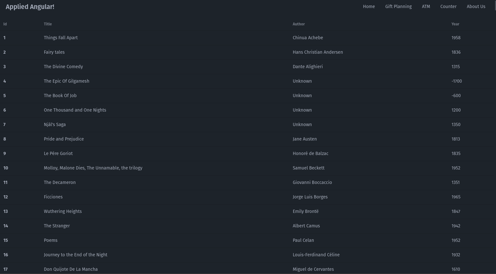

# Books

The mock API has an endpoint at `/api/books`. It supports a `GET` request.

We want to create a componet that lists out the data from the results of the HTTP call to this endpoint.

## Steps

### 1. Create a Feature

In `/src/app/features` create a feature folder called `books` with a `books.component.ts` and a `books.routes.ts`

Create the component and create the routes as in the Counter lab.

Add a link to the nav bar for the books.

_extra credit - hide the link and protect the route using a feature flag called `books`_

### 2. "ProtoType" - Getting the data

Replace your `books.component.ts` with the following:

```typescript
import { JsonPipe } from "@angular/common";
import { Component, ChangeDetectionStrategy, resource } from "@angular/core";

export type BookEntity = {
  author: string;
  country: string;
  imageLink: string;
  language: string;
  link: string;
  pages: number;
  title: string;
  year: number;
  id: string;
};

type BookApiResponse = {
  data: BookEntity[];
};
@Component({
  selector: "app-books",
  changeDetection: ChangeDetectionStrategy.OnPush,
  imports: [JsonPipe],
  template: ` <pre>{{ books.value() | json }}</pre> `,
  styles: ``,
})
export class BooksComponent {
  books = resource<BookEntity[], unknown>({
    loader: () =>
      fetch("/api/books")
        .then((res) => res.json())
        .then((r) => r.data()),
  });
}
```

Navigate to the route. We are using the Angular 19 `resource` API to take a look at the data from the API.

You should see a JSON representation of the HTTP response body. Take note of the "shape" of the data.

I've created a couple of `types` to represent to TypeScript the _expected_ response from the API. There is a `BookEntity` type for each book, and a `BookApiResponse` to match the shape of the JSON coming from the API.

In TypeScript, the types are for "us" and don't have anything to do with "reality" in the browser. They are just a way for the compiler to do some "checking" for us as we code, and give us some code completion.

We only care about the list of `BookEntity` - so update the resource definition in the component to look like this:

```typescript
books = resource<BookEntity[], unknown>({
  loader: () =>
    fetch("/api/books")
      .then((res) => res.json())
      .then((r) => r.data),
});
```

When you view the page now, you should just see the raw array of books.

Now, let's convert the raw data displayed into an HTML table that displays the id, title, author, and year.

Choose something that works for you from [DaisyUi](https://daisyui.com/components/table/) and use that.

It should look something like this when you are done:



## Expanding / Lifting State / Etc.

If all you needed was a list of books on a page, you'd be nearly done at this point, but that would make a weak lab, wouldn't it?

I want you to experiment with "lifting state",

Remember in the Counter lab how we had multiple routes - one for the UI and one for the Prefs? With the books, I'd like you to:

1. In the `books` feature, create a couple of pages.
   1. `list.component.ts`
   2. `stats.component.ts`

Add them as child routes in `books.routes.ts`.

Make it so that it shows the `list.component.ts` by default, if no other route is specified. (look at our `app.routes.ts` for how we redirect to `home`).

Add links on the `books.component.ts` for the list, and the stats pages.

Extract the code that makes the API call and and displays the table to the `list.component.ts`.

In the `stats.component.ts` create some code that displays:

1. The total number of books.
2. The earliest year a book was published from our list.
3. The most recent year a book was published from our list.
4. The average number of pages of the books.

It is OK to use the resource code for this part and simply call the API again from this component. Since the resource returns an Signal, you can create `computed` values on this component to derive the values to display.

> Note: making multiple API calls to the same API Resource is fine. _If_ the data is just used to display. The API probably _SHOULD_ include a `cache-control` header, so the browser's cache will fulfill subsequent requests if they are within the "fresh" time.

## Draw the Rest of the Tick


This is going to get more complicated _quickly_.

### Make the Table Sortable

When the user clicks on a column header in the list of books, the list should be sorted by that column.

If they click on the title column, the table will be sorted alphabetically by title, for example.

If they click on the title column _again_ the table will be sorted in reverse alphabetical order.

Do the same thing for each of the columns.

> Hint: You can do this part in the component for now. Use signals, computed, etc.

### Create a "Prefs" component and route.

Add another page (`prefs.component.ts`) and add a route to it.

Create a UI affordance to allow the user to select their preference for how the table is sorted. (a dropdown? radio buttons?)

When they return to the list, it should be sorted by that selected value.

Oh, and when they click on a different column header and return to the `prefs` page, it should have automatically changed the preference to the column they selected.

Save this and retrieve it from localstorage so their preferences are persisted across browser refreshes.

### See the Details

On the list, make it so that each title becomes a hyperlink that takes them to a route that will show the details for that particular book. (so, for example, `../details/13`)

Add a page called `details.component.ts` to display _all_ of the data about that book. (id, title, author, country, language, pages, year, and links for the image (or show the image), and the link provided to the book)

The challenge here will be that our API does not allow you to request a single book at a time. You will have to do some **heavy** state lifting.

Suggestions:

- Create a service for the API call that has a way to load and retrieve the books (we will leave the `resource` api behind and move to the `HttpClient` and Observables as in the gift giving service.)

Create a store to hold the books as entities, and create a `_load` method that uses our service to load the books. Make it so that the books are loaded when the store is initialized.

Provide both the service and the books in the routes.

Add a method on the store to set the id of the currently selected book. This should be set from the `details` component when the component is initialized.

Created a `computed` value on the store that returns the book they selected. Display that book in the details.

If the `id` you read from the URL doesn't correspond to a book in the store, display a message telling them that the book isn't found, and give them a link to return to the list.

### Refactor the List and The Prefs Component

Have both of these components rely on the store for their "source of truth" about the books and their sorting preferences.

### Extra Credit

Make it so that every five seconds, the list of books is fetched again from the API "behind the scenes" to make sure the data is up to date.
